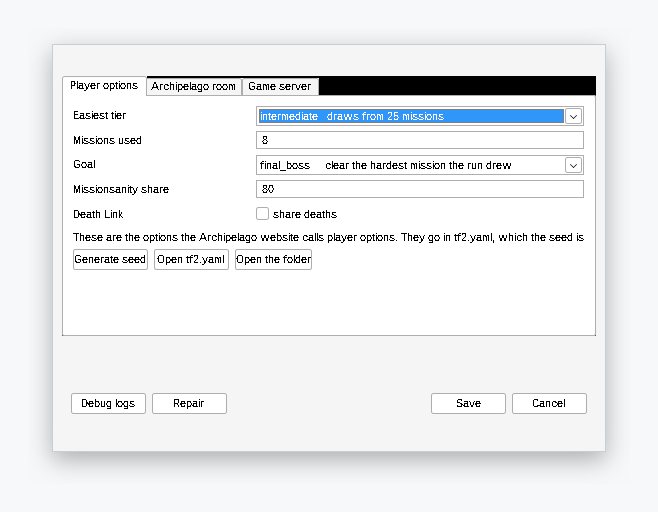
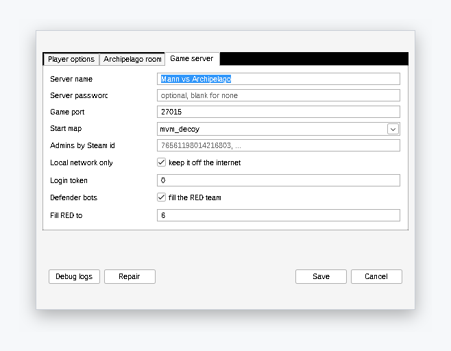

# Mann vs Archipelago

An [Archipelago](https://archipelago.gg) randomizer for Team Fortress 2, in
Mann vs Machine mode. The classes, the weapon slots and the missions start
locked. The team clears waves to unlock them. Everybody on the server shares
the same unlocks.

<p align="center">
  <a href="https://github.com/m-this/tf2-archipelago/releases/latest/download/tf2ap.exe">
    
  </a>
</p>

<p align="center">
  
</p>

## Windows

Download `tf2ap.exe` and run it. One file: no Docker, no clone, no compiler.
It opens a window and asks for the address of your Archipelago room. Then it
installs the rest: SteamCMD, the game server, SourceMod, the plugin, and the
bots that fill your team.

The window holds the log, **Start** and **Stop**, an **rcon** box, and
**Settings**. Settings makes the seed for you with the Archipelago app,
writes the player file, and bundles the logs to send when something looks
wrong. A **Test mode** plays without any room at all.

<p align="center">
  
  
</p>

[The Windows guide](./docs/en/setup/install-windows.md) takes you from the
download to the first wave.

## Docker

For any machine with Docker:

```sh
cp deploy/.env.example .env   # SRCDS_RCONPW, AP_HOST and AP_PORT have no default
make seed                     # upload the file to archipelago.gg, open a room
make up
make logs
```

`make seed` generates the multiworld here, because archipelago.gg generates
only the games that ship with Archipelago. It hosts the file all the same, so
the stack runs no Archipelago server of its own.
[`COMPOSE_PROFILES=selfhost`](./docs/en/setup/create-the-session.md) brings one
back. `TF2AP_TEST_MODE=1` plays without a room at all.

Every release attaches a `compose.yaml` that pulls published images instead of
building them. See
[`docs/en/setup/install.md`](./docs/en/setup/install.md#without-the-repository).

The first start downloads about 14 GB of game files.

## The bots on your team

Valve balances every wave for six players. The server fills the RED team with
bots that play. They pick classes, fight, buy their own upgrades and ready
themselves, so two people can win a run. See
[The bots on your team](./docs/en/play/defender-bots.md).

## Why MvM

MvM is the only TF2 mode with built-in progress:

- A mission is an ordered series of waves.
- A team clears a wave, or fails it.
- A shop sells upgrades that persist.
- A round is an ordered series of missions.

This structure maps directly onto Archipelago's regions and locations.
Classic TF2 has none of it.

## How it works

Three processes. One source of truth.

```
  gamedata/ (Go)  ──generates──>  apworld/tf2_mvm/data/*.json
        │                                   │
        │ built into                        │ read at generation
        v                                   v
    bridge (Go)  <──websocket──>  Archipelago server (archipelago.gg)
        ^
        │ HTTP + JSON on 127.0.0.1
        v
  SourceMod plugin  (inside the game server)
```

The SourceMod plugin is the only part that sees the game. The Go bridge is
the only part that speaks Archipelago. `gamedata/`, in Go, is the only part
that knows what a mission or a weapon is. It exports that data as JSON for
the Python apworld. The Windows launcher runs the bridge in-process next to
the game server; the compose stack runs them as two containers.

Players connect with a stock TF2 client. They install nothing.

## Directory tree

| Directory | Language | Role |
| --- | --- | --- |
| [`gamedata/`](./gamedata/) | Go | Source of truth: maps, missions, waves, weapons, upgrades, robots, and the IDs. Exports the JSON. |
| [`bridge/`](./bridge/) | Go | Archipelago client. WebSocket, reconnection, a durable queue, and a loopback HTTP API for the plugin. |
| [`fakeroom/`](./fakeroom/) | Go | The multiworld of one that test mode serves, with simulated players. |
| [`apworld/`](./apworld/) | Python | A thin apworld. It reads the exported JSON and sets the regions, the rules, and the YAML options. |
| [`plugin/`](./plugin/) | SourcePawn | Detects the objectives. Applies the unlocks. |
| [`launcher/`](./launcher/) | Go | The Windows exe: a window over the bridge and the game server, the installer, the seed generator's driver. |
| [`deploy/`](./deploy/) | Compose, shell | The images, the compose files, and the build of the defender bots. |
| [`docs/`](./docs/) | Markdown | The book, in English and French. Spec, ADRs, prior art, and the original Discord thread. |

## Development

```sh
make check        # everything CI runs
make integration  # real Archipelago and bridge, driven the way the plugin drives them
make launcher     # cross-compile tf2ap.exe into dist/
make bots         # stage the defender bots the image and the exe carry
```

## Documentation

`docs/` is a book, in English and in French. GitHub Pages publishes it at
[m-this.github.io/tf2-archipelago](https://m-this.github.io/tf2-archipelago/),
and `make docs` builds and serves the English version on `127.0.0.1:8081`.

- [`docs/en/SUMMARY.md`](./docs/en/SUMMARY.md): the table of contents.
- [`docs/en/archipelago-for-mvm-players.md`](./docs/en/archipelago-for-mvm-players.md):
  for a player new to a multiworld. The vocabulary and the chat commands.
- [`docs/en/spec.md`](./docs/en/spec.md): the design. Scope, locations,
  items, and goals.
- [`docs/en/adr/`](./docs/en/adr/): the decisions, and why the alternatives
  lost.
- [`docs/en/discord-mvm-thread.md`](./docs/en/discord-mvm-thread.md): the
  original Archipelago Discord thread, copied word for word. **Damonj17**
  and **Roseburst** wrote the design.
- [`docs/en/prior-art.md`](./docs/en/prior-art.md): what exists already,
  most of all the fork
  [ALPHAMARIOX/TF2-MvM-Archipelago](https://github.com/ArchipelagoMW/Archipelago/compare/main...ALPHAMARIOX:TF2-MvM-Archipelago:main).
- [`CONTEXT.md`](./CONTEXT.md): the glossary. Archipelago's and MvM's
  vocabularies share words but not their meanings; this file fixes both.

## Credits

The design comes from the Archipelago Discord thread. **Damonj17** set the
premise and the shape of the items and the checks. **Roseburst** wrote the
entire YAML options schema. **adeleine64DS**, **Amazia**, **Snolid Ice**,
**mudkipslike**, **TheBreadstick**, **CrystalClear**, and **Pixel Silzavon**
contributed. The starting data tables come from **ALPHAMARIOX**'s fork. The
bots are [OfficerSpy's MvM Defender TFBots](https://github.com/OfficerSpy/TF2-MvM-Defender-TFBots).
