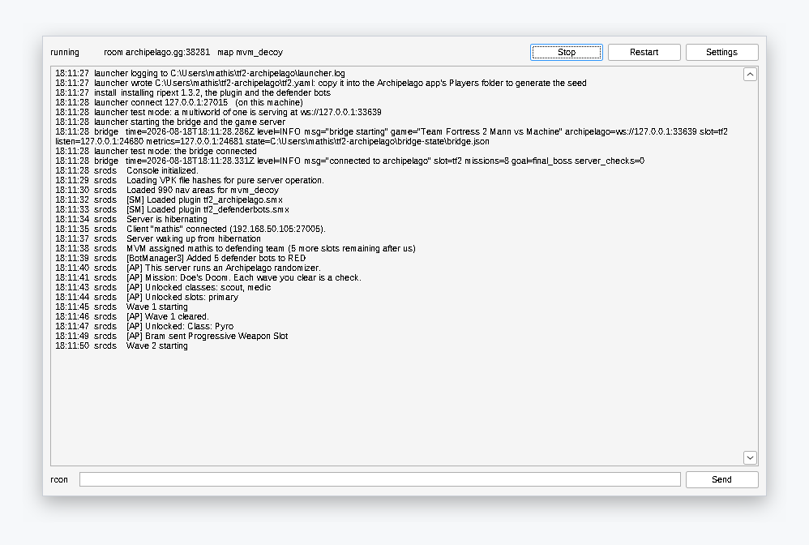
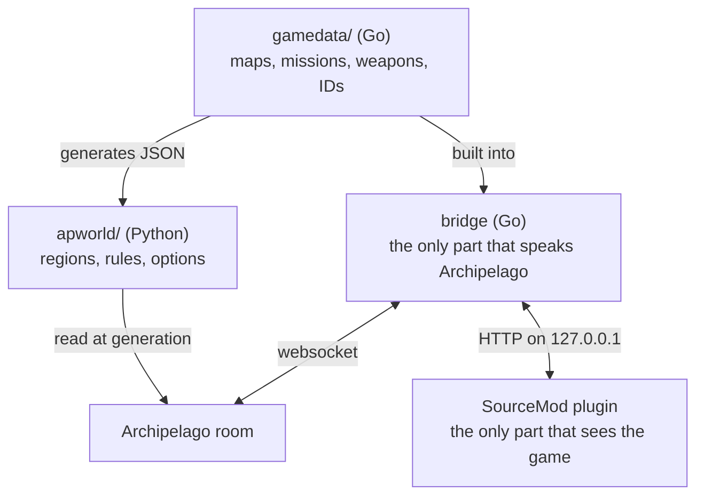

# Mann vs Archipelago

An [Archipelago](https://archipelago.gg) randomizer for Team Fortress 2, in
Mann vs Machine mode. The classes, the weapon slots and the missions start
locked. The team clears waves to unlock them. Everybody on the server shares
the same unlocks.

<p align="center">
  <a href="https://github.com/m-this/tf2-archipelago/releases/latest/download/tf2ap.exe">
    
  </a>
  <a href="https://github.com/m-this/tf2-archipelago/releases/latest/download/tf2ap-linux-amd64">
    
  </a>
</p>

> [!NOTE]
> **Windows warns about `tf2ap.exe`, and it is a false positive.** The file
> unpacks archives and starts a game server without a code signature, which
> looks like a virus to a scanner. Check it rather than trust it: every release
> publishes `SHA256SUMS` and a VirusTotal report, and `make launcher` builds the
> same file on your machine.

<p align="center">
  
</p>

## Start

**Windows.** Download `tf2ap.exe` and run it. One file: no Docker, no clone, no
compiler. SmartScreen stops you the first time, so click **More info**, then
**Run anyway**. [The Windows guide](./docs/en/setup/install-windows.md) goes
from there to the first wave.

**Linux.** The same program with a full-screen terminal interface, which works
over SSH. [The Linux guide](./docs/en/setup/install-linux.md) has the rest.

```sh
curl -fsSLO https://github.com/m-this/tf2-archipelago/releases/latest/download/tf2ap-linux-amd64
chmod +x tf2ap-linux-amd64
./tf2ap-linux-amd64
```

**Docker.** [The Docker guide](./docs/en/setup/install.md) sets up a clone, or
runs the published images with no clone at all.

The first start downloads about 14 GB of game files.

Custom MvM packs can be overlaid without modifying the container image. The
[community content guide](./community-content/README.md) covers custom BSPs,
population files, stable Archipelago IDs, validation, and the rebuild/relaunch
sequence. In the standalone launcher, community downloads happen only through
**Download Selected Community Assets**. Use **Use Local Community Assets** for
full pack ZIPs you already have; **Start** never downloads community content.

## What you get

- **A full team with two people.** Valve balances every wave for six players.
  Bots fill RED, pick classes, fight, buy their own upgrades and ready
  themselves. [The bots on your team](./docs/en/play/defender-bots.md).
- **Nothing to install for the players.** They join with a stock TF2 client.
- **One file to run.** It installs SteamCMD, the game server, SourceMod, the
  plugin and the bots.
- **Windows, Linux or Docker**, from the same settings.
- **A test mode** that plays with no Archipelago room at all.
- **Nightly builds** off `main`, at
  [`nightly`](https://github.com/m-this/tf2-archipelago/releases/tag/nightly).
  Replaced without warning, and it promises nothing.

## What the randomizer does

**Checks** are the waves your team clears and the missions it finishes. Each
mission also holds two: the first tank your team destroys, and the first giant it
kills. The world has 29 missions and 181 waves.

**Items** are the mission tickets that open a mission, the classes that let you
play a mercenary, and the progressive weapon slots. The server shares every one
of them: an unlock opens for everybody on it. `Cash Bundle` is the filler, and it
pays 200 credits.

**The goal** is either the hardest mission the run drew, or a share of the
missions in any order.

**DeathLink** is off by default. A lost wave sends a death; an arriving death
loses the wave you are on.

[What the randomizer changes](./docs/en/what-the-randomizer-changes.md) has the
detail, and [Archipelago for MvM players](./docs/en/archipelago-for-mvm-players.md)
has the vocabulary.

## How it works



Three processes, one source of truth. The launcher runs the bridge beside the
game server; the compose stack runs them as two containers.
[The repository](./docs/en/repository.md) says what each directory holds and why
Mann vs Machine is the mode this works in.

## Documentation

`docs/` is a book, in English and French, published at
[m-this.github.io/tf2-archipelago](https://m-this.github.io/tf2-archipelago/).
`make docs` serves the English one on `127.0.0.1:8081`.

- [Table of contents](./docs/en/SUMMARY.md)
- [Design spec](./docs/en/spec.md): scope, locations, items, goals
- [The decisions](./docs/en/adr/), and why the alternatives lost
- [The Discord thread](./docs/en/discord-mvm-thread.md) that designed this,
  word for word. Not in the book: it is a record, not a page to read.
- [Glossary](./CONTEXT.md): Archipelago and MvM share words but not their
  meanings
- [Code signing policy](./docs/en/code-signing.md)

## Licence

This repository is MIT ([LICENSE](./LICENSE)). What it ships is not all MIT. The
defender bots are GPL-3.0, and every other project in the bot stack keeps its own
terms. [Defender bots](./docs/en/play/defender-bots.md) names them one by one.

This is a fan project, not affiliated with or endorsed by Valve Corporation.
[Trademarks and artwork](./docs/en/licences.md) says what this project borrows,
and from where.

## Credits

The design comes from the Archipelago Discord thread.

- **Damonj17** set the premise and the shape of the items and the checks.
- **Roseburst** wrote the entire YAML options schema.
- **ALPHAMARIOX**'s fork is where the starting data tables come from.
- **adeleine64DS**, **Amazia**, **Snolid Ice**, **mudkipslike**,
  **TheBreadstick**, **CrystalClear** and **Pixel Silzavon** contributed.
- **SwagDoll420**, **EZKSupernova**, **k-kaneta**, **Cowser** and **Peppy**
  play-tested the runs the issue list comes from. Most of what the bots do came
  from their reports.
- **kelly-cs** wrote the weapon buffs, the community map support and the spawn
  recovery the bots needed to play those maps.

The bots are [OfficerSpy's MvM Defender TFBots](https://github.com/OfficerSpy/TF2-MvM-Defender-TFBots),
carried in [a fork](https://github.com/m-this/tf2-mvm-bots).
